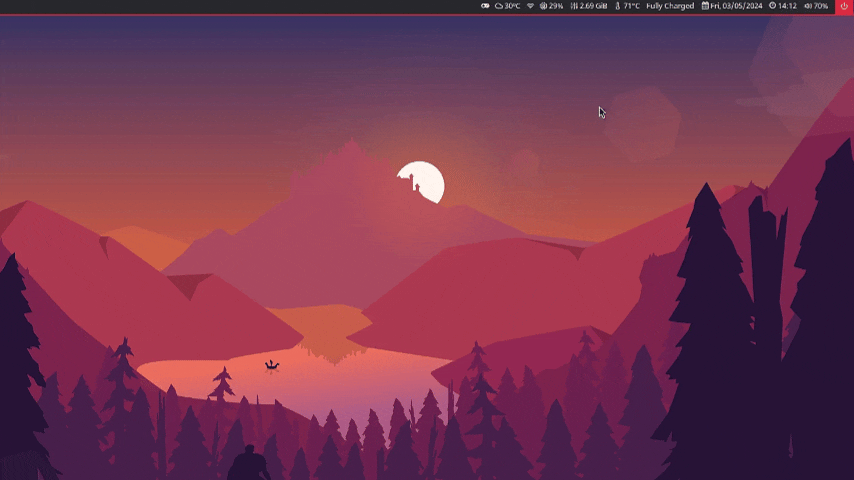

# TWM Weather


## Overview
TWM Weather is a Shell Script application created to be a module of the Polybar status bar, providing real-time weather information. It uses the Rofi Menu for a user-friendly interface and the OpenWeather API to obtain accurate weather data. Although the project was developed with a focus on Polybar, the application can be used on other status bars.



**Note:**
At the moment, only Brazilian cities are available. 
However, you can implement a dataset from a different country and make the necessary adjustments to make it work.


## Prerequisites
- Polybar
- Rofi 1.6.1 (later versions will work, but will need adjustments to the menu theme)
- Curl (to make requests to the OpenWeather API)
- Generate your own API on [OpenWeatherMap](https://openweathermap.org/)
- libnotify for status bar notifications (optional)

## Content
The project files are distributed as follows:
- `menu.sh` - main file, responsible for starting the menu.
- `scripts/` - directory that contains the project interaction files, such as: add or remove city, menu status and API call.
- `dataset/` - directory with files that store persistent and dynamic data
- `current_values/` - directory where the values are constantly updated

## How to use
1. **Generate API on OpenWeatherMap**
   - Visit the [OpenWeatherMap](https://openweathermap.org/) website and click on 'Sign Up' to create a new account
   - After creating your account and logging in, navigate to the 'API keys' section in the control panel
   - Click on 'Generate' to create a new API key. You can give the key a name to easily identify it later
   - Now that you have an API key, you can use it to make requests to the OpenWeatherMap API

2. **Clone the repository**
    ```
    git clone https://github.com/your_username/your_project.git
    ```

3. **Access the project’s API configuration**
    ```
    vim twm-weather/scripts/api.sh
    ```
    Add your API to the `API_KEY` variable, replacing `$OPEN_WEATHER_API` or setting an environment variable:
    ```
    ## Open Weather API
    API_KEY=$OPEN_WEATHER_API # Set your API here or use an environment variable
    ```

4. **Starting the menu**
    
    Access the project root directory and start the menu:
    ```
    ./menu.sh
    ```

    Now just add or remove the desired cities.

## Adding TWM Weather status on Polybar
Here is an example of a configuration to be used in Polybar:

- Access the configuration file
    ```
    vim .config/polybar/user_modules.ini
    ```
    
- Add the following code snippet at the end of the file:
    ```
    [module/twm-weather]
    type = custom/script
    exec = $HOME/.config/polybar/scripts/twm-weather/scripts/run.sh
    tail = true
    interval = 5
    click-left = $HOME/.config/polybar/scripts/twm-weather/menu.sh
    click-right=notify-send "$(cat $HOME/.config/polybar/scripts/twm-weather/current_values/current_city && cat $HOME/.config/polybar/scripts/twm-weather/current_values/current_description)"
    ```

- Finally, add the module in the config.ini file:
    ```
    vim .config/polybar/config.ini
    ```
    Example: `modules-center = twm-weather`

## Contact
If you have any questions, feel free to reach out!

[](mailto:hygorhailer@outlook.com)
